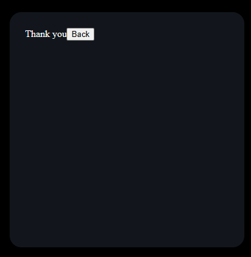

# Frontend Mentor - Interactive rating component solution

This is a solution to the [Interactive rating component challenge on Frontend Mentor](https://www.frontendmentor.io/challenges/interactive-rating-component-koxpeBUmI). Frontend Mentor challenges help you improve your coding skills by building realistic projects.

## Table of contents

- [Overview](#overview)
  - [The challenge](#the-challenge)
  - [Screenshot](#screenshot)
  - [Links](#links)
- [My process](#my-process)
  - [Built with](#built-with)
  - [What I learned](#what-i-learned)
  - [Continued development](#continued-development)
- [Author](#author)

**Note: Delete this note and update the table of contents based on what sections you keep.**

## Overview

### The challenge

Users should be able to:

- View the optimal layout for the app depending on their device's screen size
- See hover states for all interactive elements on the page
- Select and submit a number rating
- See the "Thank you" card state after submitting a rating

### Screenshot

Unfortunately, I did not take a screenshot before adding the styles to the Main component; here it is the first-creenshot after adding the styles:

!

How the thank you page looked like in V1.0:

!

How it looked like after V1.4

!

### Links

- Solution URL: [Add solution URL]([https://your-solution-url.com](https://www.frontendmentor.io/solutions/i-solved-this-challenge-using-react-and-flexbox-pVRB0a7_aw))
- Live Site URL: ([https://your-live-site-url.com](https://galvez121.github.io/rating-app/))


### Built with

- Semantic HTML5 markup
- CSS custom properties
- Flexbox
- [React](https://reactjs.org/) - JS library

### What I learned

Use this section to recap over some of your major learnings while working through this project. Writing these out and providing code samples of areas you want to highlight is a great way to reinforce your own knowledge.

To see how you can add code snippets, see below:

I have learned how to use an array to create a list in React (JSX code).

```html
<ul>
  {[1, 2, 3, 4, 5].map((value) => (
  <li>{value}</li>
  ))}
</ul>
```

```html
<h1>Some HTML code I'm proud of</h1>
```

I have a better understanding on how display flex works; here I learned how to center elements using justify-content and align-items

```css
.star_logo {
  display: flex;
  justify-content: center;
  align-items: center;
  width: 40px;
  height: 40px;
}
```

I learned how to add a svg as an React component

```js
import { ReactComponent as ThankYouIllustration } from "../src/illustration-thank-you.svg";

<ThankYouIllustration />;
```

I had a hard time finding a way to pass the props between the RatingPage() and ThanksPage(); at the end, I combined the components StartLogo() and Text() in a single component and created a new function that will control the prop for the ThanksPage(). (You can see the difference between the V1 and V2 in the commits)

**Note: Delete this note and the content within this section and replace with your own learnings.**

### Continued development

I need to practice the usage of State and Props in React. I took me some time to create the submit functionality.

In future projects I want to improve how I analyze a website and come with the different react components neccesary to create it.

I have forgotten how to add svg elements. This project helped me with that. I

**Note: Delete this note and the content within this section and replace with your own plans for continued development.**

## Author

- Instagram - [@juan_gszs](https://www.instagram.com/juan_gszs/)
- Frontend Mentor - [@Galvez121]([https://www.frontendmentor.io/profile/yourusername](https://www.frontendmentor.io/profile/Galvez121)https://www.frontendmentor.io/profile/Galvez121)
